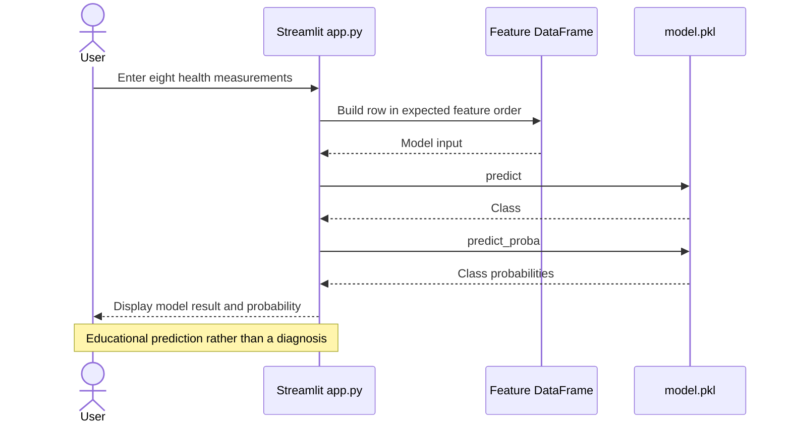

# Diabetes Classification Demo

A Streamlit demonstration that applies a saved classifier to health and lifestyle inputs, alongside a notebook for exploratory analysis and model comparison.

**Technology:** Python · scikit-learn · pandas · Streamlit

## Features

- Collect gender, age, hypertension, heart disease, smoking history, BMI, HbA1c, and blood glucose inputs.
- Run the saved model and display its predicted class and available probability output.
- Explore SMOTE and compare Logistic Regression, Random Forest, and Gradient Boosting in the notebook.

## Repository guide

| Path | Purpose |
|---|---|
| [app.py](app.py) | Interactive prediction interface. |
| [alaa hamdy.ipynb](alaa%20hamdy.ipynb) | Exploration and classifier experiments. |
| [diabetes.csv](diabetes.csv) | Dataset used by the notebook. |
| [model.pkl](model.pkl) | Saved inference model. |
| [requirements.txt](requirements.txt) | Application dependencies, including the pinned scikit-learn version. |

## Requirements and current limitations

Keep the committed model and input encoding together; the requirements pin scikit-learn to `1.6.1`. The notebook reads the included `diabetes.csv`. Its training imports include imbalanced-learn and visualization packages beyond the app's runtime list.

This is an educational model demonstration. Its output is not a clinical diagnosis or a validated estimate of an individual's medical risk.

## UML diagrams

### Main workflow

The Streamlit app builds an eight-feature row for the committed model and displays its classification and probability.



## Getting started

```bash
git clone https://github.com/IbrahimAbdelsattar/diabetes.git
cd diabetes
```

Use a Python virtual environment:

```bash
python -m venv .venv
```

Activate it with `source .venv/bin/activate` on macOS/Linux or `.venv\Scripts\Activate.ps1` in PowerShell.

```bash
python -m pip install -r requirements.txt
python -m streamlit run app.py
```
